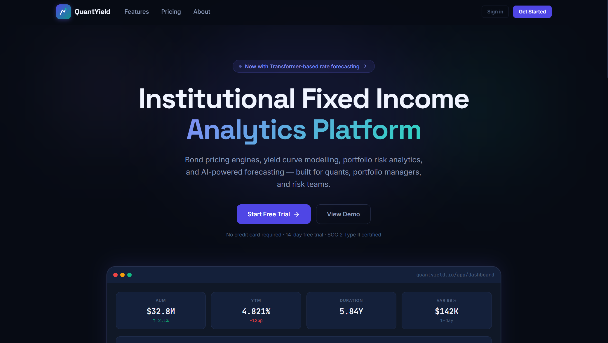

# QuantYield


## Institutional Fixed Income Analytics Platform

QuantYield is a fixed income analytics platform: a Django REST Framework backend for bond pricing, yield curve modeling, portfolio risk, and scenario analysis, with a genuine React web dashboard that the platform's own documentation didn't previously mention at all. Advanced forecasting and volatility models (a Transformer, an LSTM, GARCH/EGARCH, XGBoost credit-spread prediction) are real, working implementations that degrade gracefully to simpler fallbacks (an AR(1) model, historical volatility) when their optional dependency (PyTorch, arch, or XGBoost) isn't installed, since none of the three is a hard requirement of the base install.

<div align="center">
  
</div>

## Table of Contents

- [Overview](#overview)
- [Project Structure](#project-structure)
- [Feature Status](#feature-status)
- [Technology Stack](#technology-stack)
- [Architecture](#architecture)
- [Installation and Setup](#installation-and-setup)
- [Running the Stack](#running-the-stack)
- [API Surface](#api-surface)
- [Testing](#testing)
- [CI/CD Pipeline](#cicd-pipeline)
- [Documentation](#documentation)
- [Contributing](#contributing)
- [License](#license)

## Overview

QuantYield demonstrates a fixed income analytics workflow across a real, runnable codebase. The Django backend and its five apps (core, bonds, portfolios, curves, analytics) are wired and covered by tests, with JWT authentication and an auto-generated OpenAPI schema. A React web dashboard exists as a full, working client with its own login, register, and analytics pages, but earlier documentation for this project never mentioned it.

## Project Structure

```
QuantYield/
├── code/
│   ├── backend/               # Django REST Framework application
│   │   ├── quantyield/        # Project config: settings (base/dev/prod), urls, asgi/wsgi
│   │   ├── apps/              # core (auth), bonds, portfolios, curves, analytics
│   │   ├── services/          # Pricing and curve-building service layer
│   │   └── tests/             # Backend test suite
│   └── ml_services/           # Forecasting, volatility, credit spread, regime,
│                              # and PCA factor models (framework-agnostic,
│                              # advanced dependencies optional with fallbacks)
├── frontend/                  # React (Vite) web dashboard, not covered by
│                              # earlier documentation for this project
├── docs/                      # Numbered documentation set (01 through 08)
├── infrastructure/            # Backend-only Dockerfile and compose variant, nginx
├── docker-compose.yml         # Full stack: db, redis, api, nginx
└── README.md
```

## Feature Status

### Application tier (wired and tested)

| Component                              | Details                                                                                                                                                                                     |
| :------------------------------------- | :------------------------------------------------------------------------------------------------------------------------------------------------------------------------------------------ |
| **API**                                | Django REST Framework, versioned under `/api/v1/`, with JWT auth (obtain, refresh, register, me) and an auto-generated OpenAPI schema (drf-spectacular) served at `/docs/`.                 |
| **Bond pricing**                       | Dirty and clean price, a Brent-method YTM solver, accrued interest, and cash flow generation.                                                                                               |
| **Duration and spreads**               | Macaulay, modified, and DV01 duration, key rate duration across 10 tenors, Z-spread, and a Monte Carlo OAS calculation for callable bonds.                                                  |
| **Yield curves**                       | Nelson-Siegel, Svensson, bootstrap, and cubic spline curve construction.                                                                                                                    |
| **Portfolio risk**                     | Market value, duration, and convexity aggregation, DV01, and sector, rating, and maturity allocation breakdowns.                                                                            |
| **Scenario analysis and VaR**          | 10 standard scenarios plus custom parallel, twist, and credit shifts; historical (overlapping-window) and parametric VaR/CVaR.                                                              |
| **Forecasting (optional PyTorch)**     | A real Transformer and LSTM implementation for rate forecasting with Monte Carlo confidence bands, used if PyTorch is installed; falls back to an AR(1) model otherwise.                    |
| **Volatility (optional arch)**         | GARCH(1,1) and EGARCH via the `arch` library if installed; falls back to a historical volatility term structure otherwise.                                                                  |
| **Credit spreads (optional XGBoost)**  | XGBoost-based OAS prediction by rating, sector, and macro environment if XGBoost is installed, with a fallback estimator otherwise.                                                         |
| **Regime detection and curve factors** | An ML ensemble classifying yield curve regimes (normal, inverted, flat, steep, humped), and PCA decomposition into level, slope, and curvature factors (via scikit-learn if installed).     |
| **Web dashboard**                      | React app (Vite, plain JavaScript) with React Router, Recharts, and Framer Motion, covering a landing page, login, register, dashboard, bonds, portfolios, curves, ML, and analytics pages. |

## Technology Stack

| Area                     | Technology                                                      |
| :----------------------- | :-------------------------------------------------------------- |
| Web framework            | Django 5, Django REST Framework, drf-spectacular (OpenAPI 3.0)  |
| Auth                     | djangorestframework-simplejwt                                   |
| Database                 | SQLite in development, PostgreSQL in production                 |
| Cache                    | Local memory by default, configurable to Redis via `CACHE_URL`  |
| Numerical core           | NumPy, SciPy, pandas                                            |
| Deep learning (optional) | PyTorch, for the Transformer and LSTM forecasters               |
| ML ensemble (optional)   | scikit-learn (regime detection, PCA), XGBoost (credit spreads)  |
| Volatility (optional)    | The `arch` library, for GARCH and EGARCH                        |
| Web frontend             | React 18, Vite, React Router, Recharts, Framer Motion, date-fns |
| Deployment               | Docker Compose, Uvicorn/Gunicorn, Nginx                         |
| CI/CD                    | GitHub Actions                                                  |
| Testing                  | pytest (backend); the frontend has no test suite yet            |

## Architecture

```
Client
  └── frontend (React, Vite)          ── HTTP/JSON ──┐
                                                       ▼
Backend (Django REST Framework, /api/v1)
  ├── Apps    core (auth), bonds, portfolios, curves, analytics
  ├── Services  pricing, curve building
  └── Data layer  PostgreSQL/SQLite, cache (local memory or Redis)

ML services (code/ml_services, imported by the analytics app)
  forecaster (Transformer/LSTM, optional PyTorch, AR(1) fallback)
  volatility_model (GARCH/EGARCH, optional arch, historical fallback)
  credit_spread_model (XGBoost, optional, with a fallback estimator)
  regime_classifier · pca_factor_model (optional scikit-learn)
```

See the [numbered documentation set](#documentation) for detail, starting with `docs/01_overview.md`.

## Installation and Setup

Prerequisites: Python 3.11+ and Node.js 18+.

```bash
git clone https://github.com/quantsingularity/QuantYield.git
cd QuantYield

# Backend
cd code/backend
pip install -r requirements.txt
cp ../../.env.example .env

# Optional: advanced ML models
pip install torch arch xgboost scikit-learn

# Frontend
cd ../../frontend
npm install
```

## Running the Stack

```bash
# Backend (from code/backend)
python manage.py migrate
python manage.py seed_data
python manage.py runserver          # http://localhost:8000

# Frontend (from frontend)
npm run dev
```

API docs at `http://localhost:8000/docs/`; the Django admin at `http://localhost:8000/admin/`.

Full stack in containers:

```bash
cp .env.example .env
docker compose up --build
```

For a backend-only container setup, see `infrastructure/docker-compose.backend-only.yml`.

## API Surface

Base URL `http://localhost:8000/api/v1/`.

| Group      | Prefix               | Highlights                                                   |
| :--------- | :------------------- | :----------------------------------------------------------- |
| Auth       | `/api/v1/auth`       | `token`, `token/refresh`, `register`, `me`                   |
| Bonds      | `/api/v1/bonds`      | Pricing, duration, spread, and cash flow endpoints           |
| Portfolios | `/api/v1/portfolios` | Portfolio risk, allocation, VaR, and scenario endpoints      |
| Curves     | `/api/v1/curves`     | Curve construction and factor decomposition                  |
| Analytics  | `/api/v1/analytics`  | Forecasting, volatility, credit spread, and regime endpoints |

Full request and response schemas are in `docs/02_api_reference.md`, and interactively at `/docs/` once the API is running.

## Testing

```bash
# Backend (from code/backend)
pytest
```

| Test file                                            | Test count |
| :--------------------------------------------------- | :--------- |
| `test_pricing.py` (service layer, no database)       | 19         |
| `test_curve_builder.py` (service layer, no database) | 17         |
| `test_bonds_api.py` (API integration)                | 16         |
| `test_portfolios_api.py` (API integration)           | 12         |
| `test_auth_api.py` (API integration)                 | 15         |

That's 79 test functions across 5 files. See `docs/08_testing.md` for how to run and extend the suite.

## CI/CD Pipeline

GitHub Actions (`.github/workflows/cicd.yml`) runs three jobs on push, pull request, and manual dispatch:

| Job                 | Depends on          | What it does                                                                       |
| :------------------ | :------------------ | :--------------------------------------------------------------------------------- |
| Code Quality Checks | -                   | Formatter checks across the repository                                             |
| Backend Tests       | Code Quality Checks | Runs the pytest suite with coverage and uploads the coverage report as an artifact |
| Frontend Build      | Code Quality Checks | Installs dependencies and produces the production web build (no test step)         |

## Documentation

| Document                                             | Contents                                              |
| :--------------------------------------------------- | :---------------------------------------------------- |
| [docs/01_overview.md](docs/01_overview.md)           | Architecture, capabilities, technology stack          |
| [docs/02_api_reference.md](docs/02_api_reference.md) | Endpoint reference with request/response schemas      |
| [docs/03_quant_models.md](docs/03_quant_models.md)   | Mathematical models: pricing, duration, curves, VaR   |
| [docs/04_ml_ai_models.md](docs/04_ml_ai_models.md)   | AI models: Transformer, LSTM, GARCH, XGBoost, PCA     |
| [docs/05_deployment.md](docs/05_deployment.md)       | Production deployment, Docker, environment setup      |
| [docs/06_configuration.md](docs/06_configuration.md) | Configuration reference for all settings              |
| [docs/07_data_models.md](docs/07_data_models.md)     | Database schema: tables, fields, constraints, indexes |
| [docs/08_testing.md](docs/08_testing.md)             | Test suite, running tests, adding tests, CI           |

## Contributing

Open a pull request.

## License

This project is licensed under the MIT License - see the [LICENSE](LICENSE) file for details.
